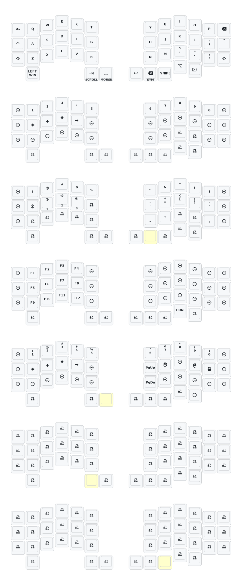

This keeb created by a group of people who loves keyball.

Special Thanks to:  
PCB: *[yangxing844](https://github.com/yangxing844)*  
Case: *[delock](https://github.com/delock)*  
Firmware: *[Amos698](https://github.com/Amos698)*  

# XCMKB session
Thanks for the above contribution and *[inorichi](https://github.com/inorichi/zmk-pmw3610-driver)* too.

## Quick Link
[Keymap Editor](https://nickcoutsos.github.io/keymap-editor/)  
[Github, Keymap Editor Setup and Flashing](https://github.com/superxc3/zmk_config_sofle#steps) - using Sofle wireless as reference 

## Notes
### Flashing
1. If you only change the keymap, you can just flash to the master side. For Keyball series, master is on the right. That means you don’t need to flash left and right.
2. Double press the corner two buttons together for reset bootloader. If double press doesn’t call out the new folder to drag your UF2, check MY COMPUTER for any new drive, or you may need to double press even faster.
3. You don’t need to delete any files in the nicenano folder, just drag your new right UF2 to it and ignore and skip any errors.
4. Normally, you don’t need to re-pair after formatting. It will pair automatically.  
    
   
These are preset reset button for keyball44 wireless to replace the harder-to-reach physical reboot button. To activate, hold the red inner thumb key and tap the outer key twice on each side to call up the reboot folder.

   
### Charging
5. You can just plug in cable and flip the power button on to charge. Push to left on both sides to turn on the keyboard.
6. You can charge both sides togehter. Slave (left) normally lasts longer than the master (right).
7. If you want to make sure flawless connection, you can plug in cable to right and use as wired mode. Left doesnt need to plug in wire and remains wireless.
8. If you want to keep your battery healthy yet want to make sure flawless connection, you can flip the power button off and plug in cable to right. This makes sure the board is using in wired mode but doesnt always charge the battery.

### Switch Installation
9. Please note that thumb area switch is upside down compare to the other zones.
10. Thumb supports v1 and v2 choc sockets too. You have to change the switch plate and shorter screw provided in the package.
 
## Trackball Layer
1. `Auto Mouse`: Layer 4 (when you move the trackball, it automatically goes to Layer 4. `J` for left click, `L` for right click, `:"` for middle click, you always can remap to something else in keymap editor. There is timeout for this automouse layer. It is fixed atm).
2. `Scroll`: Layer 5
3. `Snipe`: Layer 6 (cursor moves super slow for precision)

## Trackball Configuration
1. To change the Scroll Layer, go to `zmk-config-Keyball44/blob/main/config/boards/shields/keyball_nano/keyball44_right.overlay`: [scroll-layers=5](https://github.com/superxc3/zmk-config-Keyball44/blob/f8baf78875826e159ae2df97b634e0c81fdea17c/config/boards/shields/keyball_nano/keyball44_right.overlay#L57). Change the number 5 to your preferred layer.
2. To change the defaul CPI, go to `zmk-config-Keyball44/blob/main/config/boards/shields/keyball_nano/keyball44_right.conf`: [CONFIG_PMW3610_CPI=1200](https://github.com/superxc3/zmk-config-Keyball44/blob/f8baf78875826e159ae2df97b634e0c81fdea17c/config/boards/shields/keyball_nano/keyball44_right.conf#L7). Other trackball config could be changed in the same file too, eg., snipe CPI, scroll direction etc.
3. You may turn off the Auto Mouse layer if you find it is too sensitive, go to `zmk-config-Keyball44/blob/main/config/boards/shields/keyball_nano/keyball44_right.overlay`: [automouse-layer = <4>;](https://github.com/superxc3/zmk-config-Keyball44/blob/ff51495a1cc33ca3d4c3b530bc5b413b647f6a70/config/boards/shields/keyball_nano/keyball44_right.overlay#L59) and add `//` in front of it, or just remove the line. 

 
## Default Keymap

